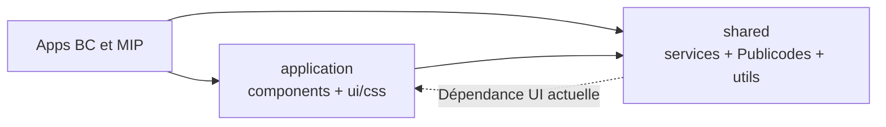

# Architecture des paquets

## Organisation

- `packages/application/components` : composants communs.
- `packages/application/ui` : composants UI et styles (`css/`).
- `packages/shared` : services, Publicodes, providers, i18n, types et utils.
- L’alias `@abc-transitionbascarbone/css` pointe vers `packages/application/ui/css`.

